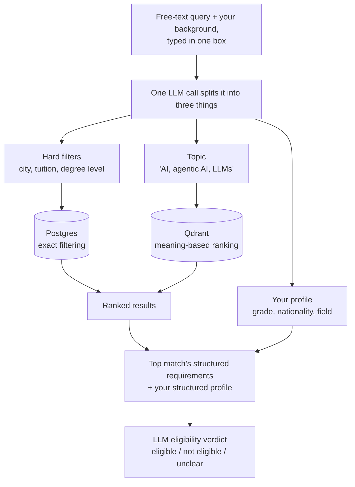

# Study in Germany — DAAD Program Search

*Natural-language search over ~2,400 real German study programs, with LLM eligibility reasoning that's engineered not to lie to you.*

[](https://github.com/MuneebaNasir/study-in-germany/actions/workflows/ci.yml)

**Live demo:** https://frontend-snowy-ten-66.vercel.app
**API:** https://daad-search-api-1032065198351.us-central1.run.app

## Does it actually work?

Yes, it's live — running on free-tier infrastructure (Vercel + Google Cloud Run + Neon Postgres + Qdrant Cloud).

## The problem

Most program-search tools make you speak their language — pick from dropdowns, guess the right keyword, hope "no tuition fees" is phrased the way the site expects. A student should be able to just describe what they're looking for, in their own words, the way they'd explain it to a study-abroad counselor — not learn a filter UI first.

## What it does

<!--
  TODO: add real screenshots to assets/screenshots/, then uncomment below.
  Suggested shots: (1) the landing page with the pre-filled example query,
  (2) a results list with eligibility badges, (3) the admission-guide drawer open
  showing the structured requirements and verdict.

  <p align="center">
    
  </p>
-->

- Type a free-text query (e.g. *"Master's in robotics, taught in English, no tuition fees, near Berlin — I have a 3.2 GPA on a 4.0 scale from Pakistan"*) and get back matching programs, ranked, with an eligibility verdict.
- One LLM call parses the query into **three structured outputs at once** — hard filters, a semantic-search string, and a student profile.
- Retrieval is hybrid: exact filters **and** meaning-based similarity search, so both hard constraints ("no tuition fees") and fuzzy topics ("agentic AI and large language models") are honored in the same query.
- Eligibility reasoning never touches raw admission text at query time — it compares two already-structured things: the program's requirements and the student's profile.

## Architecture

```
                     ┌─▶ Postgres (filters, structured eligibility)
React (Vite + TS) ──▶ FastAPI + async SQLAlchemy
   Chat-style UI      │                ├─▶ Qdrant (vector search over program embeddings)
                       │                └─▶ LangChain: Groq → Mistral → Gemini (fallback chain)
                       │
                  extraction pipeline (offline, once per program)
                  raw admission text ──▶ structured eligibility schema
```

## Tech stack

- **AI/LLM:** LangChain (structured output + `.with_fallbacks()`), Groq (Llama 3.3), Mistral, Google Gemini, `sentence-transformers` (local embeddings, `BAAI/bge-large-en-v1.5`, no API key/rate limit)
- **Backend:** Python, FastAPI, SQLAlchemy (async), Pydantic
- **Data:** PostgreSQL (Neon), Qdrant (vector search)
- **Frontend:** React, TypeScript, Vite, TanStack Query, Radix UI, Tailwind CSS
- **Deployment:** Google Cloud Run (backend, scale-to-zero), Vercel (frontend), Docker — all on free tiers
- **Testing:** pytest + Vitest/Testing Library/MSW, TDD throughout, 90+ tests across both stacks

## How it works

Two databases hold two different kinds of truth about each program, and a search touches both:

- **Postgres** holds the *exact* facts: university, city, languages taught, tuition, course level, and — from a separate offline extraction step — each program's admission requirements broken into structured fields (a grade threshold, which language tests are accepted, whether a degree prerequisite applies).
- **Qdrant** holds a *meaning* vector for each program, generated from its description. This is what lets "agentic AI and large language models" match a program that never uses those exact words, by comparing meaning rather than keywords.

A query flows through both:



1. **Query → structure.** Your free text becomes hard filters, a topic string, and a profile — one LLM call, one pass.
2. **Matching.** The filters narrow the candidates in Postgres; the topic string gets embedded and ranked by similarity against Qdrant. Both apply together.
3. **Results.** You get a ranked list, each program tagged with an eligibility status.
4. **Profile matching.** For the top match, your structured profile and the program's structured requirements — never raw text — go to the LLM together, which returns a verdict and a short reason. Every other result is checkable the same way on demand, so the app isn't paying for an LLM call on results you never open.

## Under the hood

Some of the decisions behind the AI/LLM integration specifically:

- **Structured extraction over raw-text matching.** Admission requirements are extracted into a typed schema (`grade_requirement`, `language_requirements`, `standardized_tests` with conditional waivers, `degree_prerequisite`) once, ahead of time, by a dedicated pipeline — decoupling the expensive/fragile extraction step from every-query reasoning, and making eligibility reasoning a structured-data comparison instead of an LLM re-reading a wall of legal text on every request.
- **Hallucination mitigation, treated as several separate mechanisms rather than one silver bullet:** structured output (Pydantic schemas via `.with_structured_output()`) constrains what the model can return in the first place, instead of parsing free-form text and hoping it's well-formed; the eligibility schema gives the model an explicit `"unclear"` verdict so it can say "not enough information" instead of being forced into a confident guess; the extraction pipeline attaches its own `extraction_confidence` ("high"/"medium"/"low") to every program so low-confidence extractions are visibly flagged, not presented as ground truth; and anything computable (grade-scale conversion) is computed in code, never asked of the model at all — the smallest surface area for hallucination is the one where the LLM is never given the chance. A known residual failure mode (weaker fallback-tier models occasionally misjudge which of two grades is "better" on the German scale) is documented directly in code rather than hidden.
- **Three-provider fallback chain**, via LangChain's `.with_fallbacks()`, across Groq (Llama 3.3) → Mistral → Gemini, so one provider's rate limit or outage doesn't take the pipeline down. Verified which provider actually answered a given call using a custom `BaseCallbackHandler` that reads `response_metadata` off `on_llm_end` — a non-invasive way to add observability without changing the fallback chain's return contract.
- **Deterministic math kept out of the LLM's hands.** Grade-scale conversion (e.g. a US 4.0 GPA or 10-point Indian CGPA → the German 1.0–5.0 scale) is computed with a fixed formula in code, not left to the model — added after directly observing a weaker fallback-tier model get the "is 3.0 better or worse than 2.5, given lower-is-better" comparison backwards. The LLM is handed the pre-computed value as a fact, not asked to derive it.
- **Cost-aware by measurement, not guesswork.** Real per-query token costs were measured against live traffic (~1,119 tokens for query parsing, ~4,932 tokens for a batch eligibility-reasoning call), and used to design an explicit cost cap: automatic eligibility reasoning runs only for the top-ranked candidate of a fresh search (a ~90% cut vs. reasoning over every result), with the rest reachable on demand — and paginating never re-triggers reasoning for a page already seen.
- **Graceful degradation as a first-class design, not an afterthought.** If query parsing fails on every LLM provider, the app falls back to pure semantic search over the raw query text instead of erroring; if the embedding/vector layer fails, it degrades to filtered DB-only search. Same philosophy applied consistently at every LLM/vector boundary.
- **Structured production observability.** Every query logs the raw input, which LLM provider actually responded, the extracted filters/profile, and — for eligibility specifically — the exact structured inputs fed to the reasoning call, so real production behavior is inspectable after the fact rather than inferred from user reports.

## File structure

```
├── src/daad_search/
│   ├── api/                  # FastAPI routes, query orchestration, request/response schemas
│   ├── query_understanding/  # LLM query parsing, eligibility reasoning, LangChain fallback chain
│   ├── extraction/           # Offline pipeline: raw admission text -> structured eligibility
│   ├── ingestion/            # Embedding generation, Qdrant upsert
│   ├── scraping/             # DAAD catalog scraper
│   └── db/                   # SQLAlchemy models, session management
├── frontend/src/
│   ├── components/           # Query box, results list, admission-guide drawer, loading states
│   ├── hooks/                # TanStack Query hooks (search, pagination, eligibility evaluation)
│   ├── api/                  # Typed API client
│   └── lib/                  # Verdict merging, display helpers
├── tests/                    # pytest suite (unit + integration, real Postgres/Qdrant for integration)
├── Dockerfile                # Backend container (CPU-only torch, multi-stage build)
└── docker-compose.yml        # Local Postgres + Qdrant for development
```

## Running locally

```bash
# Backend
docker compose up -d          # Postgres + Qdrant
cp .env.example .env          # fill in your own API keys
uv sync --extra dev
uv run uvicorn daad_search.api.main:app --reload

# Frontend
cd frontend
npm install
npm run dev
```

Run tests: `uv run pytest -m "not integration"` (backend) and `npm test` (frontend, from `frontend/`).

## Author

**Muneeba Nasir**
[LinkedIn](https://linkedin.com/in/muneeba-nasir-5412bb166/) · muneebanasir2@gmail.com

## License

MIT
