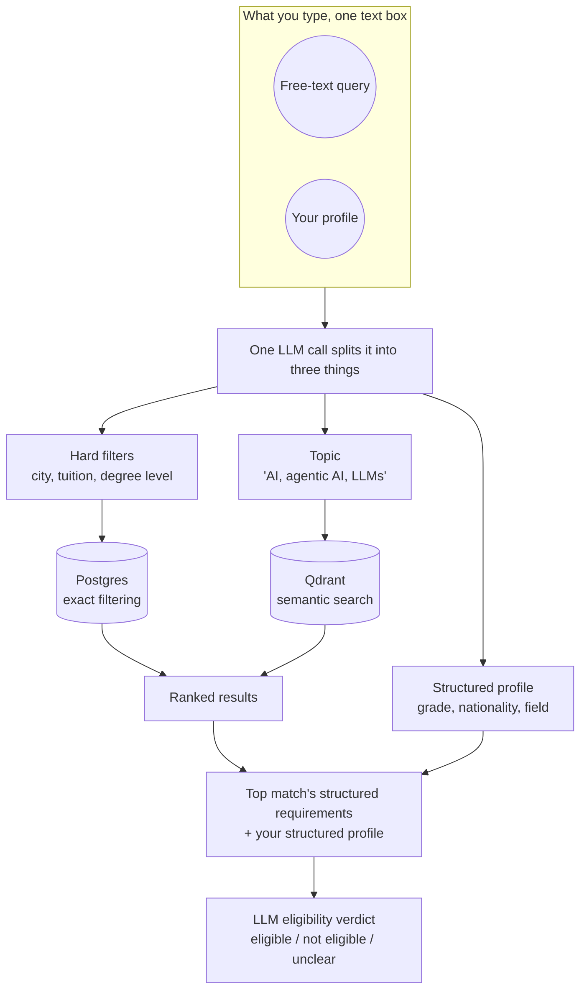
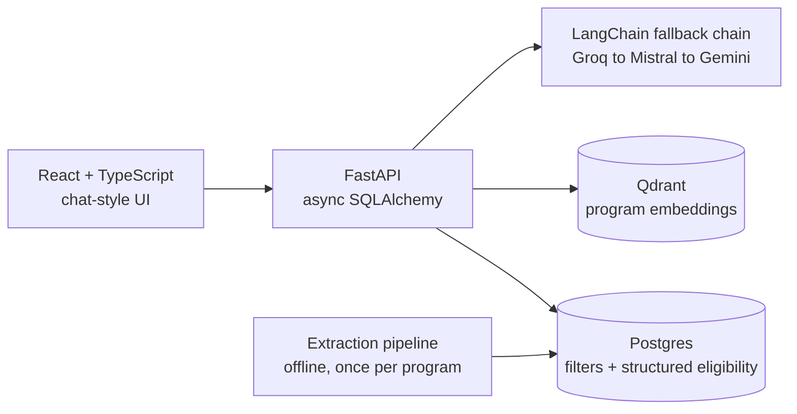

# Study in Germany: DAAD Program Search

*Your international student counselor. Write your query and we will find the right program for you.*

[](https://github.com/MuneebaNasir/study-in-germany/actions/workflows/ci.yml)

**[Try it live →](https://frontend-snowy-ten-66.vercel.app)**

## Does it actually work?

Yes, it's live, running on free-tier infrastructure (Vercel + Google Cloud Run + Neon Postgres + Qdrant Cloud). Natural-language search over ~2,400 real German study programs, with LLM eligibility reasoning built to be trustworthy, not just confident.

## The problem

Most program-search tools make you speak their language: pick from dropdowns, guess the right keyword, hope "no tuition fees" is phrased the way the site expects. A student should be able to just describe what they're looking for, in their own words, the way they'd explain it to a study-abroad counselor, not learn a filter UI first.

## How it works

<!--
  TODO: add real screenshots to assets/screenshots/, then uncomment below.
  Suggested shots: (1) the landing page with the pre-filled example query,
  (2) a results list with eligibility badges, (3) the admission-guide drawer open
  showing the structured requirements and verdict.

  <p align="center">
    
  </p>
-->

Type a free-text query, like *"Master's in robotics, taught in English, no tuition fees, near Berlin. I have a 3.2 GPA on a 4.0 scale from Pakistan,"* and get back matching programs, ranked, each with an eligibility verdict.

Two databases hold two different kinds of truth about each program, and a search touches both:

- **Postgres** holds the exact facts: university, city, languages taught, tuition, course level, and (from a separate offline extraction step) each program's admission requirements broken into structured fields, like a grade threshold or which language tests are accepted.
- **Qdrant** holds a meaning vector for each program, generated from its description. This is what lets "agentic AI and large language models" match a program that never uses those exact words, by comparing meaning rather than keywords.



1. **Query to structure.** One LLM call turns your text into hard filters, a topic string, and a profile.
2. **Matching.** The filters narrow the candidates in Postgres; the topic string gets embedded and ranked by similarity against Qdrant. Both apply together.
3. **Results.** You get a ranked list, each program tagged with an eligibility status.
4. **Profile matching.** For the top match, your structured profile and the program's structured requirements, never raw text, go to the LLM together, which returns a verdict and a short reason. Every other result is checkable the same way on demand, so the app isn't paying for an LLM call on results you never open.

## Architecture



## Tech stack

- **AI/LLM:** LangChain (structured output + `.with_fallbacks()`), Groq (Llama 3.3), Mistral, Google Gemini, `sentence-transformers` (local embeddings, `BAAI/bge-large-en-v1.5`, no API key/rate limit)
- **Backend:** Python, FastAPI, SQLAlchemy (async), Pydantic
- **Data:** PostgreSQL (Neon), Qdrant (vector search)
- **Frontend:** React, TypeScript, Vite, TanStack Query, Radix UI, Tailwind CSS
- **Deployment:** Google Cloud Run (backend, scale-to-zero), Vercel (frontend), Docker, all on free tiers
- **Testing:** pytest + Vitest/Testing Library/MSW, TDD throughout, 90+ tests across both stacks

## Under the hood

- **Structured extraction, not raw-text matching.** Admission requirements are extracted into a typed schema once, ahead of time, so eligibility reasoning is a structured-data comparison, not an LLM re-reading legal text on every query.
- **Hallucination mitigation as several mechanisms, not one fix.** Structured output constrains what the model can return. An explicit `"unclear"` verdict lets it admit uncertainty instead of guessing. Extraction confidence (high/medium/low) is tracked per program. Anything computable, like grade conversion, is computed in code, never asked of the model.
- **Three-provider fallback chain.** Groq → Mistral → Gemini via LangChain's `.with_fallbacks()`, so one provider's outage doesn't take the pipeline down. A custom callback handler confirms which provider actually answered each call, for observability.
- **Deterministic math kept out of the LLM's hands.** Grade-scale conversion (e.g. a US 4.0 GPA to the German 1.0–5.0 scale) is a fixed formula in code, not a model guess, after observing a weaker fallback-tier model get a grade comparison backwards.
- **Cost-aware by measurement.** Real token costs were measured on live traffic (~1,119 tokens to parse a query, ~4,932 for a batch eligibility call) and used to cap automatic reasoning to the top result only, cutting default per-query cost by ~90%.
- **Graceful degradation everywhere.** A failed LLM call falls back to semantic search over raw text. A failed embedding call falls back to filtered search. Same philosophy at every LLM/vector boundary.
- **Structured production logging.** Every query logs the raw input, which provider responded, and the exact structured inputs fed to eligibility reasoning, so real behavior is inspectable after the fact.

## File structure

```
├── src/daad_search/
│   ├── api/                  # FastAPI routes, query orchestration, request/response schemas
│   ├── query_understanding/  # LLM query parsing, eligibility reasoning, LangChain fallback chain
│   ├── extraction/           # Offline pipeline: raw admission text -> structured eligibility
│   ├── ingestion/            # Embedding generation, Qdrant upsert
│   ├── scraping/             # DAAD catalog scraper
│   └── db/                   # SQLAlchemy models, session management
├── frontend/src/
│   ├── components/           # Query box, results list, admission-guide drawer, loading states
│   ├── hooks/                # TanStack Query hooks (search, pagination, eligibility evaluation)
│   ├── api/                  # Typed API client
│   └── lib/                  # Verdict merging, display helpers
├── tests/                    # pytest suite (unit + integration, real Postgres/Qdrant for integration)
├── Dockerfile                # Backend container (CPU-only torch, multi-stage build)
└── docker-compose.yml        # Local Postgres + Qdrant for development
```

## Running locally

```bash
# Backend
docker compose up -d          # Postgres + Qdrant
cp .env.example .env          # fill in your own API keys
uv sync --extra dev
uv run uvicorn daad_search.api.main:app --reload

# Frontend
cd frontend
npm install
npm run dev
```

Run tests: `uv run pytest -m "not integration"` (backend) and `npm test` (frontend, from `frontend/`).

## Author

**Muneeba Nasir**
[LinkedIn](https://linkedin.com/in/muneeba-nasir-5412bb166/) · muneebanasir2@gmail.com

## License

MIT
